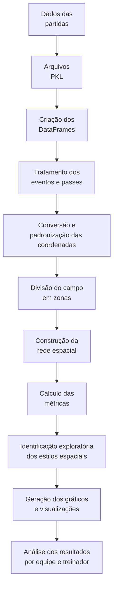

# Redes Espaciais de Passes no Futebol Brasileiro

**Título do TCC:** Redes Espaciais de Passes como Ferramenta para Análise de Assinaturas Táticas de Treinadores no Futebol Brasileiro  
**Alunos:** Bernardo Silveira de Macedo, Rhyan Nogueira Pinto e Wesley Braga de Faria  
**Semestre de Defesa:** 2026-1  

O TCC está com aproximadamente 90 MB, então pode ser que a pré-visualização não funcione corretamente. Nesse caso, será necessário fazer o download do arquivo para visualizá-lo.

O download pode demorar alguns instantes para iniciar devido ao tamanho do arquivo.

[PDF do TCC](tcc/TCC_Avaliacao_Treinador.pdf) 


[PDF do TCC comprimido 20MB](tcc/TCC_Avaliacao_Treinador_20MB.pdf) 

# TL;DR

Este repositório contém os códigos, dados tratados e visualizações utilizados no Trabalho de Conclusão de Curso sobre redes espaciais de passes no futebol brasileiro.

Para executar:

```bash
pip install -r requirements.txt
jupyter notebook
```

Depois, abra o notebook da equipe desejada, por exemplo:

```text
flamengo_2019.ipynb
```

Com o notebook aberto, execute as células em sequência. Algumas partes do código estão comentadas por não fazerem parte do fluxo principal de execução. O restante pode ser executado célula por célula, na ordem em que aparece.

# Descrição Geral

Este projeto foi desenvolvido como parte do Trabalho de Conclusão de Curso em Ciência da Computação no CEFET/RJ.

O objetivo do trabalho é investigar como redes espaciais de passes podem auxiliar na identificação de padrões recorrentes de ocupação do campo e circulação da bola, associados a possíveis assinaturas táticas de treinadores no futebol brasileiro.

Diferentemente das redes tradicionais de passes, que representam jogadores como nós e passes como conexões, este trabalho adota uma abordagem espacial. O campo é dividido em zonas, e cada passe bem-sucedido é representado como uma transição entre uma zona de origem e uma zona de destino.

A partir dessa modelagem, são calculadas métricas de redes complexas e medidas espaciais, como densidade, coeficiente de agrupamento, comprimento médio do caminho mais curto, centralidade de intermediação, maior autovalor, entropia do PageRank, cobertura espacial e entropia de ocupação.

As equipes analisadas foram:

* Flamengo 2019 — Jorge Jesus
* Palmeiras 2021 — Abel Ferreira
* Fluminense 2023 — Fernando Diniz
* Fortaleza 2024 — Juan Pablo Vojvoda
* Botafogo 2024 — Artur Jorge

Os resultados devem ser interpretados como indícios exploratórios de padrões espaciais, e não como classificações definitivas dos estilos dos treinadores.

# Funcionalidades

* Coleta e armazenamento de dados
   * Extração de dados do WhoScored
   * Armazenamento dos dados em arquivos `.pkl`
   * Organização dos dados por equipe e temporada

* Tratamento e organização dos eventos
   * Conversão dos eventos das partidas em `DataFrames`
   * Filtragem de passes bem-sucedidos
   * Tratamento das coordenadas de origem e destino dos passes
   * Padronização da direção de ataque

* Modelagem espacial do campo
   * Divisão do campo em zonas
   * Construção de redes espaciais direcionadas
   * Representação de cada zona como um nó da rede
   * Representação de cada passe como uma aresta entre zonas

* Cálculo de métricas
   * Densidade da rede
   * Coeficiente de agrupamento local
   * Comprimento médio do caminho mais curto
   * Centralidade de intermediação média
   * Maior autovalor da matriz de adjacência
   * Entropia do PageRank
   * Cobertura espacial
   * Entropia de ocupação

* Identificação exploratória de estilos espaciais
   * Foco em posse de bola e conexões curtas
   * Triangulações frequentes
   * Progressão dependente de corredores-chave
   * Padrões fortes de circulação espacial
   * Circulação com fluxo distribuído em zonas ativas
   * Alta amplitude e uso distribuído do campo
   * Transições rápidas e passes verticais
   * Concentração espacial em poucos setores

* Visualização dos resultados
   * Gráficos de frequência dos estilos por equipe
   * Gráficos comparativos entre equipes e treinadores
   * Mapas espaciais das partidas
   * Visualizações agregadas por temporada, chamadas de superpartidas
   * Figuras utilizadas no TCC e na apresentação

# Arquitetura

A arquitetura geral do projeto segue um fluxo de processamento em etapas, desde a coleta e organização dos dados até a geração das visualizações finais.



# Estrutura dos Arquivos

A estrutura principal do repositório está organizada da seguinte forma:

```text
.
├── README.md
├── requirements.txt
├── main.py
├── metrics.py
├── EPV_grid.csv
├── data/
├── tcc/
├── matches_brasileirao_2019.pkl
├── matches_brasileirao_2021.pkl
├── matches_brasileirao_2023.pkl
├── matches_brasileirao_2024.pkl
├── matches_flamengo_2019.pkl
├── matches_fluminense_2023.pkl
├── matches_fortaleza_2024.pkl
├── matches_palmeiras_2021.pkl
├── matches_botafogo_2024.pkl
├── flamengo_2019.ipynb
├── fluminense_2023.ipynb
├── fortaleza_2024.ipynb
├── palmeiras_2021.ipynb
├── botafogo_2024.ipynb
├── figs_flamengo_zones_2019/
├── figs_fluminense_zones_2023/
├── figs_fortaleza_zones_2024/
├── figs_palmeiras_zones_2021/
├── figs_botafogo_zones_2024/
├── media_metricas_brasileirao_2019.png
├── media_metricas_brasileirao_2021.png
├── media_metricas_brasileirao_2023.png
└── media_metricas_brasileirao_2024.png
```

Os arquivos `.pkl` armazenam os dados coletados e tratados das partidas. Os notebooks por equipe executam a análise específica de cada recorte equipe-temporada. As pastas `figs_*` armazenam as visualizações espaciais geradas para cada equipe.

# Dependências

As principais dependências externas utilizadas no projeto são:

* Python 3.10 ou superior
* [pandas](https://pandas.pydata.org/)
* [NumPy](https://numpy.org/)
* [NetworkX](https://networkx.org/)
* [Matplotlib](https://matplotlib.org/)
* [Seaborn](https://seaborn.pydata.org/)
* [Selenium](https://www.selenium.dev/)
* [webdriver-manager](https://pypi.org/project/webdriver-manager/)
* [openpyxl](https://openpyxl.readthedocs.io/)
* [Jupyter Notebook](https://jupyter.org/)

Também são utilizadas bibliotecas padrão do Python, como:

* `pickle`
* `os`
* `re`
* `textwrap`
* `unicodedata`
* `collections`
* `dataclasses`
* `typing`

Essas bibliotecas padrão já acompanham a instalação do Python e não precisam ser instaladas separadamente.

# Arquivo requirements.txt

O arquivo `requirements.txt` deve conter:

```txt
pandas
numpy
networkx
matplotlib
seaborn
selenium
webdriver-manager
openpyxl
jupyter
```

# Execução

## 1. Instalar o Python

Antes de executar o projeto, é necessário ter o Python instalado.

Recomenda-se utilizar Python 3.10 ou superior.

Para verificar se o Python está instalado, execute no terminal:

```bash
python --version
```

ou:

```bash
python3 --version
```

## 2. Baixar ou clonar o repositório

Clone o repositório com:

```bash
git clone URL_DO_REPOSITORIO
```

Depois, entre na pasta do projeto:

```bash
cd NOME_DA_PASTA_DO_REPOSITORIO
```

Caso o projeto tenha sido baixado manualmente em `.zip`, basta extrair o arquivo e abrir o terminal dentro da pasta extraída.

## 3. Criar um ambiente virtual

Recomenda-se criar um ambiente virtual para instalar as dependências do projeto de forma isolada.

No Windows:

```bash
python -m venv venv
```

No Linux/Mac:

```bash
python3 -m venv venv
```

## 4. Ativar o ambiente virtual

No Windows:

```bash
venv\Scripts\activate
```

No Linux/Mac:

```bash
source venv/bin/activate
```

Quando o ambiente virtual estiver ativo, o terminal normalmente exibirá algo como:

```text
(venv)
```

antes do caminho da pasta.

## 5. Instalar as dependências

Com o ambiente virtual ativo, execute:

```bash
pip install -r requirements.txt
```

Caso o arquivo `requirements.txt` ainda não exista, as dependências podem ser instaladas manualmente com:

```bash
pip install pandas numpy networkx matplotlib seaborn selenium webdriver-manager openpyxl jupyter
```

## 6. Abrir o Jupyter Notebook

Depois de instalar as dependências, execute:

```bash
jupyter notebook
```

Esse comando abrirá uma página no navegador com a estrutura de arquivos do projeto.

Caso prefira utilizar JupyterLab, execute:

```bash
jupyter lab
```

## 7. Executar um notebook

Na interface do Jupyter, abra o notebook correspondente à equipe-temporada desejada:

```text
flamengo_2019.ipynb
fluminense_2023.ipynb
fortaleza_2024.ipynb
palmeiras_2021.ipynb
botafogo_2024.ipynb
```

Com o notebook aberto, execute as células em sequência.

É possível executar de duas formas:

### Executar célula por célula

Clique na primeira célula e pressione:

```text
Shift + Enter
```

Depois repita o processo até o final do notebook.

### Executar todas as células automaticamente

No menu superior do Jupyter, selecione:

```text
Kernel > Restart & Run All
```

ou, dependendo da versão:

```text
Kernel > Restart Kernel and Run All Cells
```

Esse comando reinicia o ambiente do notebook e executa todas as células em sequência.

## 8. Observação sobre células comentadas

Algumas partes do código estão comentadas porque não são utilizadas no fluxo principal de execução.

Essas células ou trechos comentados podem estar relacionados a testes, análises auxiliares ou versões alternativas do processamento.

Para reproduzir os resultados principais, basta executar as células ativas na ordem em que aparecem no notebook.

## 9. Saídas geradas

Durante a execução, os notebooks podem gerar:

* gráficos de frequência dos estilos espaciais;
* mapas espaciais das partidas;
* superpartidas;
* arquivos `.xlsx` com dados tratados;
* figuras `.png` utilizadas no TCC;
* visualizações salvas nas pastas `figs_*`.

As figuras são salvas nas pastas correspondentes a cada equipe, por exemplo:

```text
figs_flamengo_zones_2019/
figs_fluminense_zones_2023/
figs_fortaleza_zones_2024/
figs_palmeiras_zones_2021/
figs_botafogo_zones_2024/
```

# Execução resumida

Para quem já possui Python instalado, o processo básico é:

```bash
python -m venv venv
venv\Scripts\activate
pip install -r requirements.txt
jupyter notebook
```

No Linux/Mac:

```bash
python3 -m venv venv
source venv/bin/activate
pip install -r requirements.txt
jupyter notebook
```

Depois, abra o notebook desejado e execute as células em sequência.

# Observações sobre os Dados

Os dados utilizados foram obtidos a partir do WhoScored e armazenados em arquivos `.pkl`.

Caso os arquivos `.pkl` já estejam disponíveis no repositório, não é necessário repetir a etapa de coleta dos dados.

A execução dos notebooks depende da presença dos arquivos de dados esperados, como:

```text
matches_brasileirao_2019.pkl
matches_brasileirao_2021.pkl
matches_brasileirao_2023.pkl
matches_brasileirao_2024.pkl
matches_flamengo_2019.pkl
matches_fluminense_2023.pkl
matches_fortaleza_2024.pkl
matches_palmeiras_2021.pkl
matches_botafogo_2024.pkl
```

Se algum desses arquivos estiver ausente, o notebook correspondente poderá apresentar erro ao carregar os dados.

# Resultados

Os resultados gerados pelo projeto incluem:

* gráficos de frequência dos estilos espaciais por equipe;
* gráficos comparativos entre treinadores por estilo espacial;
* visualizações espaciais de partidas individuais;
* superpartidas com agregação dos padrões de circulação por temporada;
* quadros e gráficos utilizados na análise do TCC.

# Limitações

O projeto possui caráter exploratório. Os padrões identificados não devem ser interpretados como classificações definitivas dos treinadores, mas como indícios obtidos a partir dos critérios definidos pelo modelo.

Entre as principais limitações estão:

* dependência de dados coletados por web scraping;
* uso de eventos de passe, sem dados de rastreamento dos jogadores;
* influência da divisão do campo em zonas;
* ausência de controle formal de variáveis contextuais como placar, mando de campo, força do adversário e momento da temporada;
* análise restrita aos recortes equipe-temporada considerados no TCC.

# Trabalhos Futuros

Como continuidade, sugere-se:

* ampliar a análise para outras temporadas, equipes e competições;
* explorar diferentes divisões espaciais do campo;
* incorporar variáveis contextuais das partidas;
* utilizar aprendizado de máquina para agrupar equipes ou partidas semelhantes;
* integrar dados de eventos com dados de rastreamento dos jogadores;
* comparar os resultados quantitativos com análises qualitativas feitas por especialistas em futebol.

# Autores

* Bernardo Silveira de Macedo
* Rhyan Nogueira Pinto
* Wesley Braga de Faria

Orientador: Prof. Glauco Fiorott Amorim, D.Sc.

# Instituição

Centro Federal de Educação Tecnológica Celso Suckow da Fonseca — CEFET/RJ  
Bacharelado em Ciência da Computação
